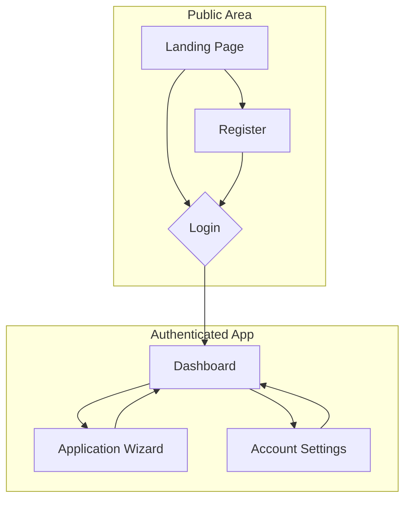
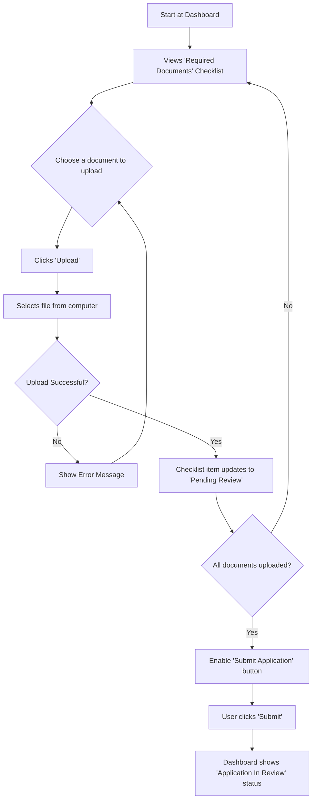

# Next-Generation Veteran Home Loans UI/UX Specification

## Introduction

This document defines the user experience goals, information architecture, user flows, and visual design specifications for the project. It serves as the foundation for visual design and frontend development, ensuring a cohesive and user-centered experience.

### Overall UX Goals & Principles

#### Target User Personas

- **Primary: The Tech-Savvy Veteran:** Digital natives who expect speed, efficiency, and a seamless self-service experience. They are comfortable with modern technology and will abandon a cumbersome process.
- **Secondary: The First-Time Veteran Homebuyer:** May be less confident with the complexities of the mortgage process and are looking for guidance, education, and a trustworthy platform to support them.

#### Usability Goals

- **Efficiency:** Users should be able to complete the core "Verified Pre-Approval" process in a single session with minimal friction.
- **Clarity:** The user should always know the exact status of their application and what the next step is without needing to contact support.
- **Confidence:** The design must instill trust and confidence, especially for first-time homebuyers who may be anxious about the process.

#### Design Principles

1. **Clarity Above All:** Prioritize clear, simple language and intuitive layouts. Avoid jargon and complex interfaces.
2. **Guided Momentum:** Break down complex processes into small, manageable steps. Always show progress and what's next to keep the user moving forward.
3. **Trust Through Transparency:** Be honest and upfront about the process, including mandatory waiting periods. Use design to make the system feel open and understandable.
4. **Accessible by Default:** Design for all users from the start, ensuring the platform meets WCAG 2.1 AA standards.

### Change Log

| Date | Version | Description | Author |
|:-----|:--------|:------------|:-------|
| 2025-06-28 | 1.0 | Initial UI/UX Spec draft. | Sally (UX) |
| 2025-06-28 | 1.1 | Revised User Flows, Wireframes, and Components for manual document upload pivot. | Sally (UX) |

## Information Architecture (IA)

### Site Map / Screen Inventory

This diagram shows the primary screens for the MVP and how they relate to each other.

### Navigation Structure

**Primary Navigation (Authenticated):** Once a user is logged in, the main navigation will be minimal. It will primarily consist of a logo that links to the Dashboard, a link to Account Settings, and a Logout button. The main user journey is guided by on-screen calls-to-action, not a complex navigation bar.

**Secondary Navigation:** There will be no secondary navigation system for the MVP, to maintain focus on the core user flow.

**Breadcrumb Strategy:** We will use breadcrumbs within the multi-step "Application Wizard" (e.g., Home > Application > Step 2 of 4) to ensure users always know where they are in the process.

## User Flows (Revised)

### Application and Document Submission Flow

**User Goal:** To complete an application by uploading all required documents and submitting it for review.

**Success Criteria:** The user successfully uploads all documents and receives confirmation that their application is "In Review".

### Edge Cases & Error Handling

- **Wrong File Type:** If a user tries to upload an unsupported file type (e.g., a .docx file), the system should show an inline error specifying the allowed types (PDF, JPG, PNG).
- **Early Submission Attempt:** The "Submit Application" button should be disabled with a tooltip explaining that all documents must be uploaded first.
- **Document Rejection:** If a loan officer later rejects a document, the flow should seamlessly allow the user to return to this screen to upload a new version.

## Wireframes & Mockups (Revised)

**Primary Design Files:** [Link to Figma Project]

### Key Screen Layouts

#### Dashboard: Document Center

**Purpose:** To provide a single, clear interface for users to see what documents are required, upload them, and track their review status.

**Layout Concept:** A clean, table-based or list-based layout with the following columns:

- **Document Name:** The name of the required document (e.g., "W-2").
- **Status:** A colored badge indicating the current status (e.g., "Not Uploaded," "Pending Review," "Approved," "Rejected").
- **Actions:** A button that changes based on the status (e.g., "Upload," "Delete," "Re-upload").
- **Feedback/Reason:** A space to display the reason for a "Rejected" status.

## Component Library / Design System (Revised)

**Design System Approach:** We will use the components provided by shadcn/ui as the foundation for our interface. Any new components created for this project will be built following the same style, accessibility standards, and technical architecture to ensure consistency.

### Core Components

#### Document Checklist/Table
**Purpose:** A component to clearly display the list of required documents and their associated status and actions.

#### Advanced File Uploader
**Purpose:** A robust component that allows a user to select a file, shows a progress bar during upload, and provides clear feedback on success or failure. It must be able to restrict uploads to specific file types (PDF, JPG, PNG).

#### Status Badge
**Purpose:** A small, colored label component to visually communicate the status of an item (e.g., a green "Approved" badge, a red "Rejected" badge).

#### Confirmation Modal
**Purpose:** A reusable dialog box to prompt users for confirmation before they perform a destructive action, such as deleting an uploaded document.

## Branding & Style Guide

### Visual Identity

We will establish a digital-first brand identity that prioritizes clarity, trust, and ease of use. The aesthetic will be clean and modern, avoiding visual clutter to help users focus on the task at hand.

### Color Palette

This palette uses a professional blue as the primary color to build trust, with a vibrant green as an accent for positive actions. The neutral grays provide a clean, modern backdrop.

| Color Type | Hex Code | Usage |
|:-----------|:---------|:------|
| **Primary** | `#2563eb` (Blue 600) | Main CTAs, interactive elements, highlights |
| **Secondary** | `#475569` (Slate 600) | Secondary buttons, less important elements |
| **Accent** | `#10b981` (Emerald 500) | Special offers, success states, unique callouts |
| **Success** | `#22c55e` (Green 500) | Positive feedback, confirmation messages |
| **Warning** | `#f59e0b` (Amber 500) | Cautions, important notices |
| **Error** | `#ef4444` (Red 500) | Errors, destructive action confirmations |
| **Neutral** | A scale from `#f8fafc` (Slate 50) to `#0f172a` (Slate 900) | Text, borders, backgrounds |

### Typography

For typography, I've chosen two highly-readable sans-serif fonts available on Google Fonts that are optimized for user interfaces.

- **Primary Font (Headings):** **Manrope**. It's modern, clean, and has a professional yet friendly feel.
- **Secondary Font (Body):** **Inter**. This font is a standard in UI design, prized for its exceptional clarity and readability at all sizes.

### Iconography

I strongly recommend using the **Lucide** icon library. It's an open-source, community-driven library known for its clean, consistent, and lightweight icons. It is the default icon set for shadcn/ui and integrates perfectly.

### Spacing & Layout

We will proceed with a standard **8-point grid system**. This means all spacing and sizing will be in multiples of 8px (e.g., 8, 16, 24, 32px). This approach will guarantee consistent, harmonious layouts across the entire application.

## Accessibility Requirements

### Compliance Target

The application must meet **Web Content Accessibility Guidelines (WCAG) 2.1 Level AA** standards.

### Key Requirements

#### Visual
- **Color Contrast:** The contrast ratio between text and its background must be at least **4.5:1** for normal text and **3:1** for large text.
- **Focus Indicators:** All interactive elements (links, buttons, form fields) must have a clearly visible focus state when navigated to via a keyboard.
- **Text Sizing:** Users must be able to resize text up to 200% without loss of content or functionality.

#### Interaction
- **Keyboard Navigation:** All functionality must be completely usable with a keyboard alone. The navigation order must be logical and intuitive.
- **Screen Reader Support:** The application must be compatible with modern screen readers (like NVDA and VoiceOver), with proper use of ARIA roles where necessary.
- **Touch Targets:** On mobile devices, all touch targets must be large enough for easy activation, with a minimum size of 44x44 pixels.

#### Content
- **Alternative Text:** All meaningful images must have descriptive `alt` text. Decorative images should have empty alt attributes.
- **Semantic HTML:** Use proper HTML5 elements for structure (e.g., `<nav>`, `<main>`, `<h1>`, `<h2>`) to ensure the document is understandable by assistive technologies.
- **Form Labels:** Every form field must have a clearly associated `<label>`.

### Testing Strategy

We will use a combination of methods to ensure compliance:

1. **Automated Testing:** Integrate accessibility checking tools (like Axe) into our development process to catch common issues automatically.
2. **Manual Testing:** Regularly test the application using only a keyboard and by using a screen reader to ensure a high-quality experience.

## Responsiveness Strategy

### Breakpoints

We will use a standard set of four breakpoints to control layout changes. These are based on common device sizes and integrate well with the chosen Tailwind CSS framework.

| Breakpoint | Min Width | Max Width | Target Devices |
|:-----------|:----------|:----------|:---------------|
| **Mobile** | (default) | 767px | Most smartphones |
| **Tablet** | 768px | 1023px | Tablets, small laptops |
| **Desktop** | 1024px | 1279px | Standard laptops and monitors |
| **Wide** | 1280px | - | Large and high-resolution monitors |

### Adaptation Patterns

- **Layout Changes:** We will use a mobile-first approach. The layout will be a single column by default (for mobile) and will expand to multi-column layouts (e.g., sidebars, grids) on larger screens (tablet and up) using a flexible grid system.
- **Navigation Changes:** On desktop, the primary navigation might be visible in the header. On mobile and tablet, it will collapse into a standard "hamburger" menu to save space.
- **Content Priority:** The most critical information and calls-to-action will be prioritized to appear at the top of the screen on mobile devices.
- **Interaction Changes:** Any functionality that relies on mouse hover (like tooltips) will have an equivalent tap-friendly alternative on touch devices.

## Animation & Micro-interactions

### Motion Principles

- **Purposeful:** All animations must have a clear purpose, such as guiding user attention, providing feedback, or illustrating a change in state. We will avoid purely decorative animations.
- **Responsive & Fast:** Motion should be quick and non-blocking, contributing to the application's overall feeling of speed and efficiency.
- **Subtle & Professional:** Animations will be subtle and professional to maintain a sense of trust and clarity. We will avoid large, distracting, or overly playful movements.

### Key Animations

- **State Transitions:** When a user moves between steps in the wizard or when content loads on the dashboard, we will use a gentle cross-fade transition to make the change feel smooth.
- **Button Feedback:** On click, buttons will have a subtle "press" effect. If an action triggers a process that takes time, the button will display a loading spinner to provide immediate feedback.
- **Form Field Focus:** When a user selects a form field, its border will smoothly transition to the primary brand color to clearly indicate the active element.
- **Status Updates:** When a status changes on the dashboard, it will subtly highlight or fade in to gently draw the user's attention to the new information.

## Performance Considerations

### Performance Goals

To ensure the application feels fast and modern, we will adhere to the following targets:

- **Page Load:** The initial loading of any page should be as fast as possible, with a target of **Largest Contentful Paint (LCP) under 2.5 seconds**.
- **Interaction Response:** The application must feel snappy. Any user interaction (like a click or tap) should have a visible response in **under 100 milliseconds**.
- **Animation FPS:** All animations and transitions should be smooth, maintaining a consistent **60 frames per second (FPS)**.

### Design Strategies

To achieve these goals, our design and development approach will include:

- **Image Optimization:** All images will be compressed and served in modern formats (like WebP) to ensure fast loading without sacrificing quality.
- **Lazy Loading:** Components, images, and data that are not immediately visible on the screen will be loaded only as the user scrolls down the page.
- **Code Splitting:** The application will be automatically split into smaller chunks by Next.js, so users only download the code necessary for the page they are currently viewing.
- **Skeleton Loaders:** When fetching data, the interface will display "skeleton" placeholders that mimic the final layout. This makes the application feel significantly faster than showing a blank screen or a generic loading spinner.

## Next Steps

### Immediate Actions

1. **Finalize and Share:** This UI/UX Specification should be shared with all project stakeholders, including the Product Manager and Architect, to ensure alignment.
2. **Begin High-Fidelity Design:** The next creative step is to begin designing the detailed, high-fidelity mockups and interactive prototypes in Figma, using this document as the guide.
3. **Handoff to Architect:** This document is now ready to be handed off to the Architect. It will serve as a key input for creating the detailed `front-end-architecture.md`, ensuring the technical structure supports our user experience goals.

### Design Handoff Checklist

- [x] All user flows documented
- [x] Component inventory complete
- [x] Accessibility requirements defined
- [x] Responsive strategy clear
- [x] Brand guidelines incorporated
- [x] Performance goals established