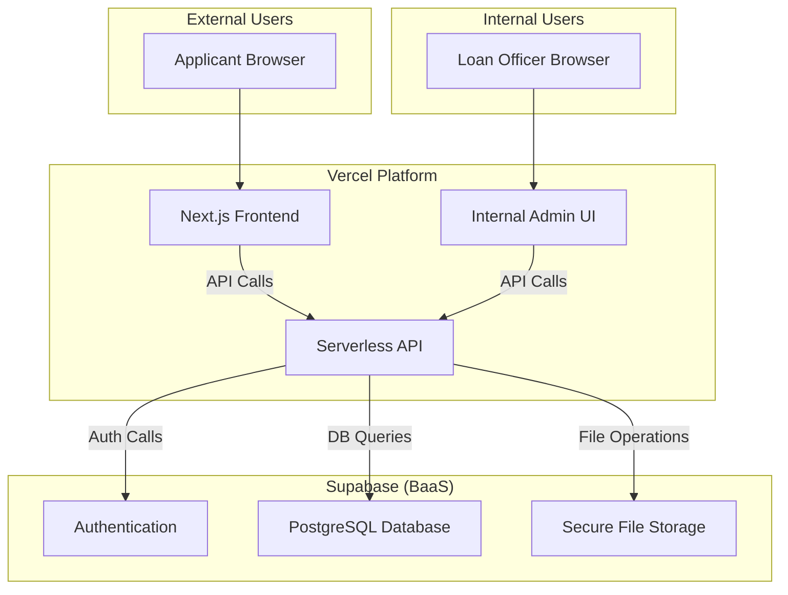
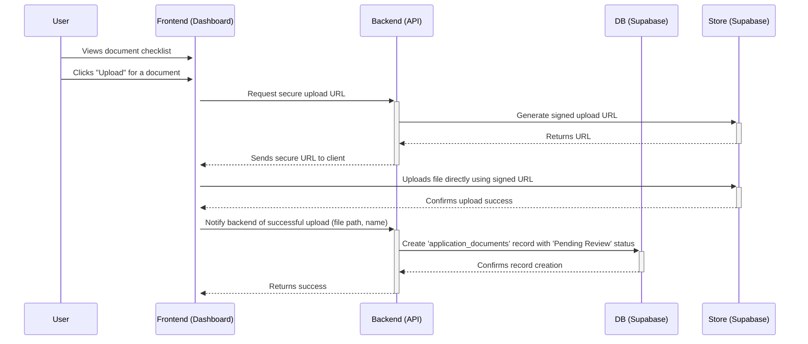
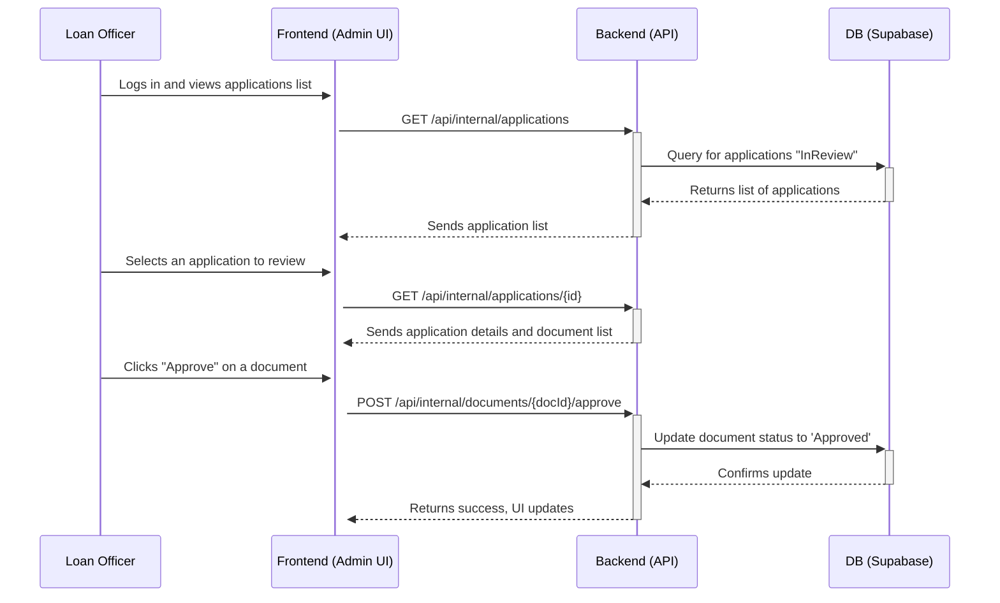

# Next-Generation Veteran Home Loans Fullstack Architecture Document

## Introduction

This document outlines the complete fullstack architecture for the "Next-Generation Veteran Home Loans" project, including backend systems, frontend implementation, and their integration. It serves as the single source of truth for AI-driven development, ensuring consistency across the entire technology stack. This unified approach combines what would traditionally be separate backend and frontend architecture documents, streamlining the development process.

### Starter Template or Existing Project

N/A - This is a greenfield project. No specific starter template was chosen in the planning phase. The architecture will be designed from scratch to align with the best practices of the selected technology stack (Next.js, Tailwind CSS, shadcn/ui).

### Change Log

| Date | Version | Description | Author |
|:-----|:--------|:------------|:-------|
| 2025-06-28 | 1.0 | Initial architecture draft. | Winston (Architect) |
| 2025-06-28 | 1.1 | Revised architecture for manual document upload pivot. | Winston (Architect) |

## High Level Architecture (Revised)

### Technical Summary

This architecture outlines a modern, full-stack application built within a **monorepo**. The frontend will be a responsive Next.js application designed to guide users through a manual document submission process. The backend is a serverless platform built with **Next.js API Routes** and the **Supabase** Platform-as-a-Service, which handles authentication, database, and file storage. The core of the architecture is a secure workflow for users to upload financial documents and for internal loan officers to review them. The system is designed to be deployed on Vercel for a seamless, scalable, and secure workflow.

### Platform and Infrastructure Choice

**Definitive Choice: Vercel + Supabase**

- **Description:** This stack uses Vercel for hosting the Next.js frontend and serverless API functions. Supabase provides the backend-as-a-service, including a PostgreSQL database, user authentication, and file storage for the document uploads.
- **Rationale:** This combination provides a powerful, scalable, and developer-friendly platform that perfectly supports the project's requirements for a secure, database-driven application with significant file management needs.

### Repository Structure

- **Structure:** **Monorepo**
- **Tool:** **Turborepo**

### High Level Architecture Diagram (Revised)

This diagram illustrates the new architecture centered around Supabase and the document review process.



## Architectural Patterns

- **Jamstack Architecture:** The frontend will be built with a Jamstack approach, pre-rendering static pages where possible for instant load times.
- **Serverless Functions:** All backend API logic will be encapsulated in stateless, serverless functions.
- **Repository Pattern:** We will use the repository pattern to abstract all database interactions.
- **Provider Pattern (State Management):** For managing global UI state, we will use React's built-in Context API.

## Technology Stack

| Category | Technology | Version | Purpose | Rationale |
|:---------|:-----------|:--------|:--------|:----------|
| Runtime | Bun | Latest | A modern, all-in-one JavaScript runtime. | Blazing-fast performance and an integrated toolchain. |
| Package Manager | Bun | N/A | Integrated package manager. | Significantly faster than npm/pnpm for installations. |
| Frontend Language | TypeScript | ~5.4 | Adds static typing to JavaScript for robustness. | Aligns with modern web standards; catches errors early. |
| Frontend Framework | Next.js | ~14.2 | React framework for production web applications. | Specified in PRD; enables high performance via SSG/SSR. |
| UI Component Library | shadcn/ui | Latest | A collection of reusable, accessible components. | Specified in PRD; speeds up UI development. |
| Backend Language | TypeScript | ~5.4 | To maintain a consistent language across the stack. | Simplifies code sharing and reduces context switching for devs. |
| Backend Framework | Next.js API Routes | ~14.2 | Built-in framework for creating serverless functions. | Natively integrated with the frontend; deploys seamlessly. |
| API Style | REST | N/A | Standard protocol for web APIs. | Universally understood and supported. |
| Database | PostgreSQL | 15+ | The database provided by our BaaS, Supabase. | Robust, reliable, and powerful open-source SQL database. |
| File Storage | Supabase Storage | N/A | For secure user document uploads. | Natively integrated with Supabase Auth and DB for security. |
| Authentication | Supabase Auth | N/A | Handles user sign-up, login, and session management. | Provides a secure, complete auth solution out of the box. |
| Testing | Bun Test | N/A | Built-in, Jest-compatible test runner. | Fast execution and eliminates the need for separate test runner configurations. |
| CI/CD | Vercel | N/A | Continuous integration and deployment platform. | Seamless, git-based workflow optimized for Next.js. |

## Data Models (Revised)

```typescript
// Revised ApplicationStatus enum
type ApplicationStatus =
  | 'NotStarted'
  | 'DocumentsRequired' // User needs to upload
  | 'InReview'          // Submitted and waiting for LO
  | 'ActionRequired'    // LO has rejected a document
  | 'Approved'          // Final approval granted
  | 'Rejected';         // Final rejection

interface LoanApplication {
  id: string;
  userId: string;
  status: ApplicationStatus;
  preApprovalAmount?: number;
  createdAt: Date;
  updatedAt: Date;
}

// Revised ApplicationDocument
interface ApplicationDocument {
  id: string;
  loanApplicationId: string;
  fileName: string;
  storagePath: string;
  status: 'Pending Review' | 'Approved' | 'Rejected';
  rejectionReason?: string;
  uploadedAt: Date;
}
```

## REST API Spec (Revised)

```yaml
openapi: 3.0.3
info:
  title: Next-Generation Veteran Home Loans API
  version: 1.1.0
  description: API for the veteran home loan platform MVP (manual upload workflow).

paths:
  /api/auth/register:
    post:
      summary: Register a new user
      # ... (same as before)
      
  /api/auth/login:
    post:
      summary: Log in a user
      # ... (same as before)
      
  /api/application:
    get:
      summary: Get the current user's loan application
      security:
        - bearerAuth: []
      # ... (same as before)
      
  /api/documents/upload:
    post:
      summary: Upload a document for an application
      security:
        - bearerAuth: []
      # ... (same as before)

  # --- NEW INTERNAL ENDPOINTS ---
  /api/internal/applications:
    get:
      summary: (Internal) Get all applications for review
      security:
        - bearerAuth: [] # Requires Loan Officer role
      responses:
        '200':
          description: A list of applications in review.

  /api/internal/documents/{docId}/approve:
    post:
      summary: (Internal) Approve a document
      security:
        - bearerAuth: [] # Requires Loan Officer role
      parameters:
        - in: path
          name: docId
          required: true
          schema:
            type: string
      responses:
        '200':
          description: Document status updated to Approved.

  /api/internal/documents/{docId}/reject:
    post:
      summary: (Internal) Reject a document
      security:
        - bearerAuth: [] # Requires Loan Officer role
      parameters:
        - in: path
          name: docId
          required: true
          schema:
            type: string
      requestBody:
        required: true
        content:
          application/json:
            schema:
              type: object
              properties:
                reason:
                  type: string
      responses:
        '200':
          description: Document status updated to Rejected.

# ... (components/schemas updated to match new data models) ...
```

## Components (Revised)

**REMOVED:**
- Plaid Integration UI
- Plaid Service

**ADDED:**
- **Document Center UI:** A user-facing interface for the document checklist, uploading files, and viewing status.
- **Internal Admin UI:** A secure, separate interface for loan officers to view applications and approve/reject documents.
- **Document Review Service:** A backend service containing the business logic for loan officers to update document statuses.

## External APIs (Revised)

**REMOVED:**
- Plaid API

**KEPT:**
- PDF Generation Service (Now used after manual approval instead of automated approval)

## Core Workflows (Revised)

### 1. User Document Submission Workflow



### 2. Internal Document Review Workflow



## Database Schema (Revised)

The schema is updated to remove Plaid fields and add status tracking for documents.

```sql
-- (Users table remains the same)

-- Loan Applications Table (Revised)
CREATE TABLE public.loan_applications (
    id UUID PRIMARY KEY DEFAULT gen_random_uuid(),
    user_id UUID NOT NULL REFERENCES public.users(id) ON DELETE CASCADE,
    status TEXT NOT NULL DEFAULT 'DocumentsRequired' CHECK (status IN ('NotStarted', 'DocumentsRequired', 'InReview', 'ActionRequired', 'Approved', 'Rejected')),
    pre_approval_amount NUMERIC(12, 2),
    created_at TIMESTAMPTZ NOT NULL DEFAULT NOW(),
    updated_at TIMESTAMPTZ NOT NULL DEFAULT NOW()
);
CREATE INDEX idx_loan_applications_user_id ON public.loan_applications(user_id);

-- Application Documents Table (Revised)
CREATE TABLE public.application_documents (
    id UUID PRIMARY KEY DEFAULT gen_random_uuid(),
    loan_application_id UUID NOT NULL REFERENCES public.loan_applications(id) ON DELETE CASCADE,
    file_name TEXT NOT NULL,
    storage_path TEXT NOT NULL,
    status TEXT NOT NULL DEFAULT 'Pending Review' CHECK (status IN ('Pending Review', 'Approved', 'Rejected')),
    rejection_reason TEXT,
    uploaded_at TIMESTAMPTZ NOT NULL DEFAULT NOW()
);
CREATE INDEX idx_application_documents_loan_application_id ON public.application_documents(loan_application_id);
```

## Unified Project Structure (Revised)

To support the internal review tool, I recommend adding a second, separate application to our monorepo for the admin interface.

```
next-gen-loans/
├── apps/
│   ├── web/            # Main customer-facing Next.js app
│   │   └── src/
│   └── admin/          # NEW: Internal admin Next.js app
│       └── src/
│           └── app/
│               └── api/
│                   └── internal/ # Internal API routes
├── packages/
│   └── ... (db, shared-types, etc. are shared between both apps)
└── ...
```